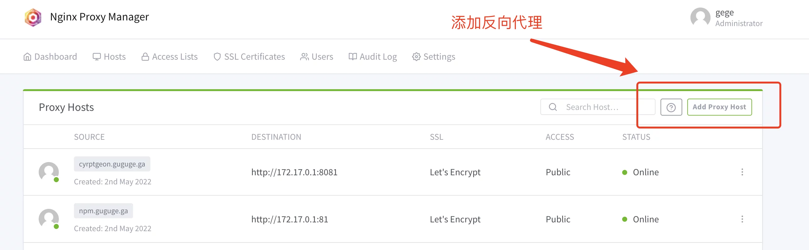
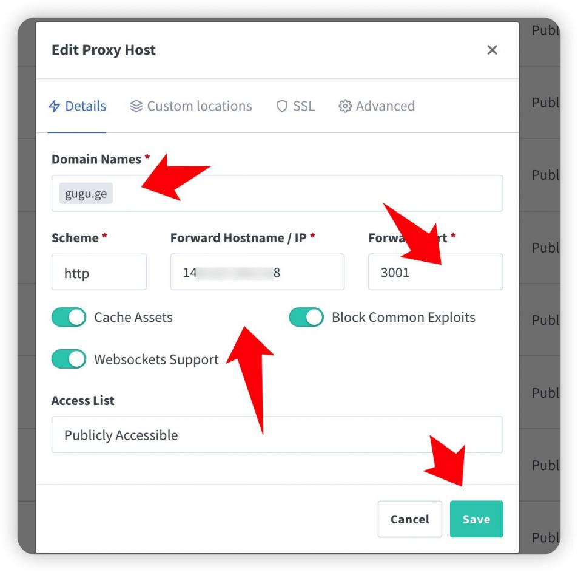
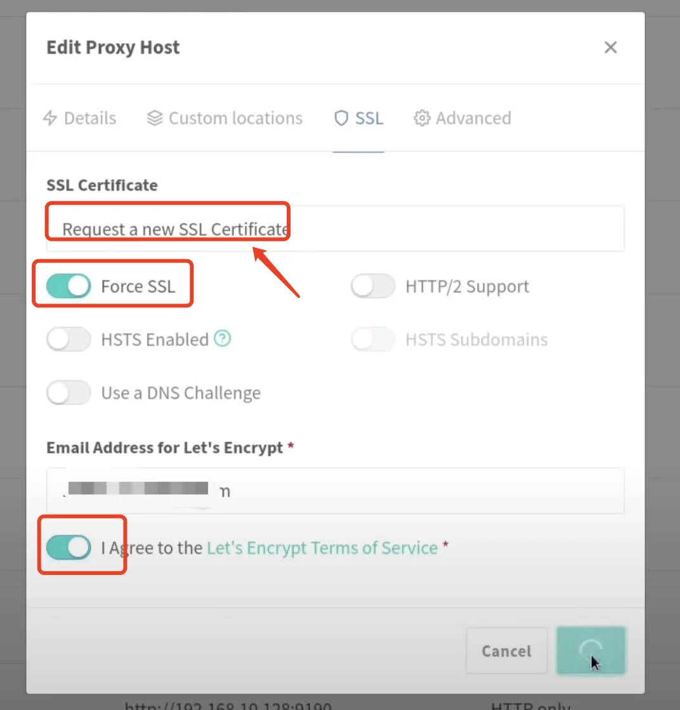
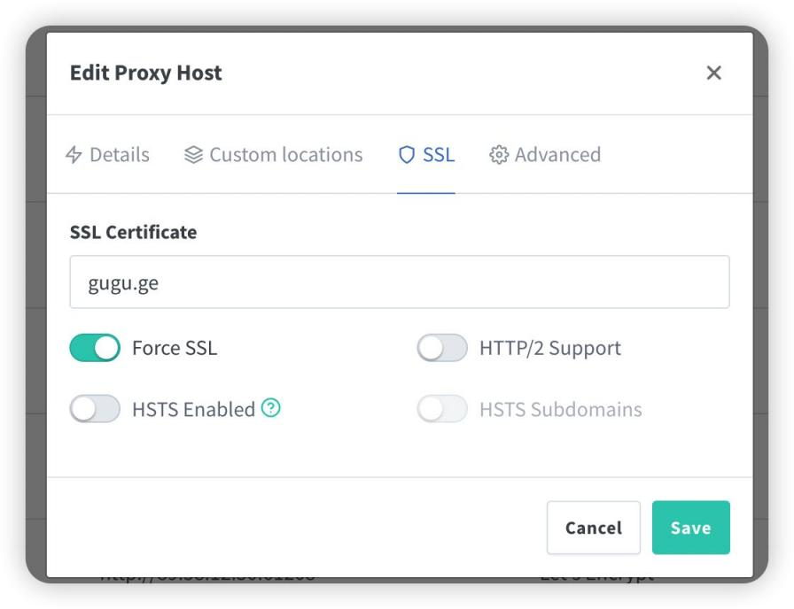

# 终端登录

```
ssh 你的用户名@你的服务器IP -P 22
```

# 设置SWAP脚本

```
wget -O box.sh https://raw.githubusercontent.com/BlueSkyXN/SKY-BOX/main/box.sh && chmod +x box.sh && clear && ./box.sh
```

# 升级packages(debian)

```
sudo -i # 切换到 root 用户
```

```
apt update -y  # 升级 packages
```

```
apt install wget curl sudo vim git nano -y  # Debian 系统比较干净，安装常用的软件
```

# 安装Docker环境

## 安装Docker（非大陆服务器）

```
wget -qO- get.docker.com | bash
```

```
docker -v  #查看 docker 版本
```

```
systemctl enable docker  # 设置开机自动启动
```

## 安装 Docker-compose（非大陆服务器）

```
sudo curl -L "https://github.com/docker/compose/releases/download/1.29.2/docker-compose-$(uname -s)-$(uname -m)" -o /usr/local/bin/docker-compose
```

```
sudo chmod +x /usr/local/bin/docker-compose
```

```
docker-compose --version  #查看 docker-compose 版本
```

## 安装Docker（国内服务器）

```
curl -sSL https://get.daocloud.io/docker | sh
```

```
docker -v  #查看 docker 版本
```

```
systemctl enable docker  # 设置开机自动启动
```

## 安装 Docker-compose（国内服务器）

```
curl -L https://get.daocloud.io/docker/compose/releases/download/v2.1.1/docker-compose-`uname -s`-`uname -m` > /usr/local/bin/docker-compose
```

如果上面脚本不可以，就直接在docker/compose下载,地址：https://github.com/docker/compose/releases  

下载后改成docker-compose

```
chmod +x /usr/local/bin/docker-compose
```

```
docker-compose --version  #查看 docker-compose 版本
```

# docker配置

## 自定义内网 IPv6 地址，开启容器的 IPv6 功能，以及限制日志文件大小

```
cat > /etc/docker/daemon.json <<EOF
{
    "log-driver": "json-file",
    "log-opts": {
        "max-size": "20m",
        "max-file": "3"
    },
    "ipv6": true,
    "fixed-cidr-v6": "fd00:dead:beef:c0::/80",
    "experimental":true,
    "ip6tables":true
}
EOF
```

```
systemctl restart docker   #重启docker
```

# 安装NPM（systemctl restart docker）

## 创建安装目录

```
sudo -i
```

```
mkdir -p /root/data/docker_data/npm
```

```
cd /root/data/docker_data/npm
```

```
nano docker-compose.yml
```

```
version: '3'
services:
  app:
    image: 'jc21/nginx-proxy-manager:latest'
    restart: unless-stopped
    ports:
      - '80:80'  # 冒号左边可以改成自己服务器未被占用的端口
      - '81:81'  # 冒号左边可以改成自己服务器未被占用的端口
      - '443:443' # 冒号左边可以改成自己服务器未被占用的端口
    volumes:
      - ./data:/data # 冒号左边可以改路径，现在是表示把数据存放在在当前文件夹下的 data 文件夹中
      - ./letsencrypt:/etc/letsencrypt  # 冒号左边可以改路径，现在是表示把数据存放在在当前文件夹下的 letsencrypt 文件夹中
```	  

保存：
1. `Ctrl+X`  
2. `Y`  
3. `Enter`  


# 防火墙端口打开

```
lsof -i:81  #查看 81 端口是否被占用，如果被占用，重新自定义一个端口
```

```
-bash: lsof: command not found     #如果出现这行命令，执行下面的命令行
```

```
apt install lsof  #安装 lsof
```

# 部署执行

```
cd /root/data/docker_data/npm
```

```
docker-compose up -d 
```

# 验证

此时在浏览器输入`http://ip:81`就可以登录了

```
Email:    admin@example.com
Password: changeme
```

官网：
`https://nginxproxymanager.com/`
`https://nginxproxymanager.com/guide/#quick-setup`

NPM的dockerhub:`https://hub.docker.com/r/jc21/nginx-proxy-manager`


# 更新方法

```
cd /root/data/docker_data/npm     # 切换到当时创建docker-compose.yml文件的文件夹
```

```
docker-compose down
```

```
cp -r /root/data/docker_data/npm /root/data/docker_data/npm.archive  # 万事先备份，以防万一
```

```
docker-compose pull
```

```
docker-compose up -d    # 请不要使用 docker-compose stop 来停止容器，因为这么做需要额外的时间等待容器停止；docker-compose up -d 直接升级容器时会自动停止并立刻重建新的容器，完全没有必要浪费那些时间。
```

```
docker image prune  # prune 命令用来删除不再使用的 docker 对象。删除所有未被 tag 标记和未被容器使用的镜像
```

*提示下方命令* 按`y`

```
WARNING! This will remove all dangling images.
Are you sure you want to continue? [y/N] 
```


# 卸载

```
cd /root/data/docker_data/npm
```

```
docker-compose down 
```

```
rm -rf /root/data/docker_data/npm  # 完全删除映射到本地的数据
```


# 使用NPM反向代理










